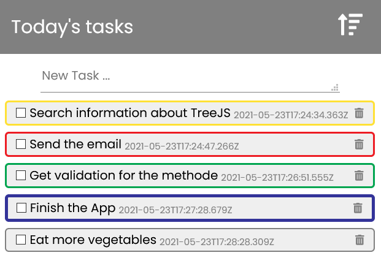
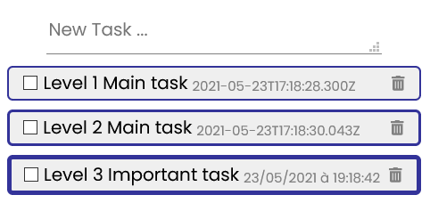
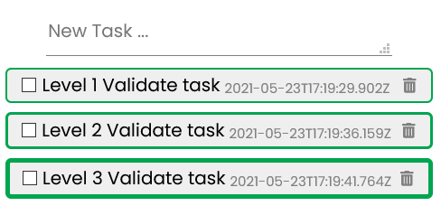
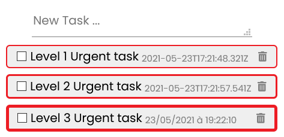
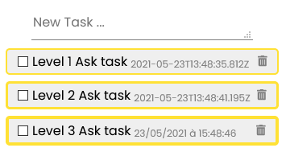

<center></center>

# ToDo - Mouse less

A todo extension to manage your daily tasks directly in your browser without opening a new tab. This extension has the objective to be usable only with a keyboard.

[](https://opensource.org/licenses/MIT)

## Installation

To install the app, run the following commands:

```bash
$ git clone https://github.com/yPerrot/TODO-mouse-less.git
$ cd TODO-mouse-less
$ npm install
```

You can then start the app with:
```bash
$ npm run start
```

Or you can build it to export it as a web extension:
```bash
$ npm run build
```

## About Extension

Here are the features available: 

1. Add Task
2. Apply style to the task via specific syntax
3. Change Tasks order (Oldest first / Newest first)
4. Delete task
5. Mark task as finished (cross it) 
6. Tasks are saved even if you power off.

## Shortcuts

Here are the shortcuts available in the extension: 

 - Open the extension: `CTRL` + `ALT` + `T`
 - Navigate between elements: `TAB` / `SHIFT` + `TAB`
 - Change tasks order: `CTRL` + `ALT` + `O`
 - Delete focused task: `DELETE`
 - Mark task as finished: `CTRL` + `ALT` + `D` 

## Styles

To apply a style to your task, start it with a valid special character repeated 1 to 3 times. The more the character is repeated the stronger the border will be.

### Main

To mark a task as a main one, use `+`.  
Here is the result for the following input:

 - \+ Level 1 Main task
 - ++ Level 2 Main task
 - +++ Level 3 Important task



### Validate

To mark a task as a validate one, use `*`.  
Here is the result for the following input:

 - \* Level 1 Validate task
 - ** Level 2 Validate task
 - *** Level 3 Validate task



### Urgent

To mark a task as an urgent one, use `!`.  
Here is the result for the following input:

 - ! Level 1 Urgent task
 - !! Level 2 Urgent task
 - !!! Level 3 Urgent task



### Ask

To mark a task as an Ask one, use `?`.  
Here is the result for the following input:

 - ? Level 1 Ask task
 - ?? Level 2 Ask task
 - ??? Level 3 Ask task



## License

This project is licensed under the MIT License - see the [LICENSE.md](https://github.com/yPerrot/TODO-mouse-less/blob/main/LICENSE.md) file for details.

The icon is made by [Freepik](https://www.freepik.com) and come from [flaticon.com](https://www.flaticon.com/)
